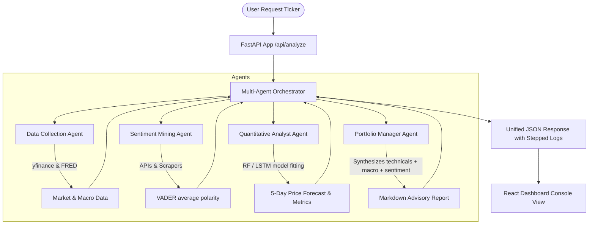

# SentiScrapper Financial Analysis - Technical Interview Revision Sheet

This guide serves as a structured revision document for technical interviews. It details the system architecture, mathematical formulas, algorithms, dependencies, and typical interview questions related to this project.

---

## 1. Project Overview & Pitch
* **The Pitch**: "I built **SentiScrapper**, a real-time, multi-agent stock forecasting system that predicts short-term equity price trends by combining quantitative signals (technical indicators), macroeconomic indices, and social media/news sentiment mined from Reddit, Twitter, Telegram, and Moneycontrol."
* **Highlights**:
  - Modular, industrial-grade backend using **FastAPI**.
  - Asynchronous, rate-limit friendly data collectors with simulated mock failovers.
  - Multi-agent coordination (Data Gathering -> Sentiment Analysis -> Quant Modeling -> Portfolio Recommendation).
  - Time-series modeling using **Random Forest** and sequence-based **LSTM Networks** accelerated by **NVIDIA GPU (GTX 1650)**.
  - Premium **React + Vite** single-page web dashboard displaying forecasts and live agent steps.

---

## 2. Directory Structure
```text
SentiScrapper Financial Analysis/
├── backend/
│   ├── app/
│   │   ├── config.py             # Loads settings, directory creators & API secrets from .env
│   │   ├── main.py               # FastAPI server defining schemas and endpoints (/api/analyze)
│   │   ├── scrapers/             # Web harvesting and financial fetchers
│   │   │   ├── market.py         # yfinance ticker fetcher & technical indicator equations (RSI, MACD)
│   │   │   ├── macro.py          # FRED inflation (CPI) and unemployment data via pandas_datareader
│   │   │   ├── reddit.py         # PRAW/asyncpraw scraper with keyword search fallback
│   │   │   ├── twitter.py        # Tweepy client interface
│   │   │   ├── telegram.py       # Telethon swing trade parser with non-blocking session validator
│   │   │   └── news.py           # BeautifulSoup4 scraping of Moneycontrol tags
│   │   ├── models/               # Mathematical modeling
│   │   │   ├── sentiment.py      # VADER polarity calculation + decay weighted sentiment factor
│   │   │   └── forecaster.py     # RF & LSTM pipelines (scaler savings, KNN Imputer, GPU toggling)
│   │   └── agents/               # Autonomous execution layer
│   │       └── orchestrator.py   # Multi-agent workflow runner (Data -> Sentiment -> Quant -> Manager)
│   ├── requirements.txt          # Explicitly pinned backend dependencies
│   └── run.py                    # Dev server startup launcher
├── frontend/                     # Modern React + Vite Single Page Application
└── .env                          # Local secrets config (secrets, ports, model paths)
```

---

## 3. Technology Stack & Key Dependencies

| Dependency | Purpose | Interview Rationale / Why it was chosen |
| :--- | :--- | :--- |
| **FastAPI / Uvicorn** | Backend API | High-performance async networking (built on Starlette and Pydantic), automated OpenAPI documentation, extremely low overhead. |
| **yfinance** | Financial Data | Easy retrieval of historical stock prices and dividends from Yahoo Finance. |
| **ta** | Quantitative Indicators | Pinned calculation of momentum (RSI, Stochastics), volatility (ATR), and trend (MACD, Moving Averages). |
| **vaderSentiment** | Natural Language Processing | Lexicon and rule-based sentiment analysis tool specifically tuned for social media sentiment (handles emojis, punctuation intensity like '!!!', capitalization). |
| **asyncpraw / PRAW** | Reddit Mining | Fetches posts from stock subreddits asynchronously without blocking the event loop. |
| **Tweepy** | Twitter/X Client | Accesses Twitter v2 API for real-time tweets search. |
| **Telethon** | Telegram Mining | Async Telegram API client that runs on Mobile/Web MTProto protocol to retrieve message histories from private/public channels. |
| **BeautifulSoup4** | HTML Web Scraping | Parses DOM tree structures to scrape news headlines from pages like Moneycontrol tags. |
| **Scikit-learn** | Machine Learning | Fits the Random Forest baseline regressor, handles data scaling, split partitions, and imputations. |
| **TensorFlow / Keras** | Deep Learning | Builds and trains the multi-layered LSTM neural network. |
| **Pandas / Numpy** | Data Wrangling | Vectors computation, alignment, index mapping, and missing value processing. |

---

## 4. Feature Engineering & Mathematics

### A. Technical Indicators
* **RSI (Relative Strength Index)**:
  Measures momentum on a scale of `0-100`. It calculates the ratio of average gains to average losses over a 14-day window:
  $$\text{RSI} = 100 - \left( \frac{100}{1 + \text{RS}} \right), \quad \text{where } \text{RS} = \frac{\text{Average Gain}}{\text{Average Loss}}$$
* **MACD (Moving Average Convergence Divergence)**:
  Trend-following momentum indicator showing relationship between two moving averages:
  $$\text{MACD Line} = \text{EMA}_{12}(\text{Close}) - \text{EMA}_{26}(\text{Close})$$
  $$\text{Signal Line} = \text{EMA}_{9}(\text{MACD Line})$$
  $$\text{Histogram} = \text{MACD Line} - \text{Signal Line}$$
* **ATR (Average True Range)**:
  Measures volatility. It calculates the moving average of the **True Range (TR)**:
  $$\text{TR} = \max[(\text{High} - \text{Low}), |\text{High} - \text{Close}_{\text{prev}}|, |\text{Low} - \text{Close}_{\text{prev}}|]$$

### B. Decay-Weighted Sentiment Factor
Social sentiment fades over time. An event mentioned 10 days ago should influence today's prediction far less than a tweet posted today. We apply an **exponential decay factor** ($d = 0.9$) over a rolling $N$-day ($10$ days) window:
$$\text{Weighted Sentiment}_t = \sum_{j=0}^{N-1} (\text{Sentiment}_{t-j} \cdot d^j)$$
This merges volatile textual polarities into a smooth continuous feature column aligned with daily pricing dates.

### C. Macro Alignment
FRED macro indicators (Inflation index, Unemployment rate) are reported monthly. Daily stocks require daily features. We perform a daily reindexing of the macro dataset followed by a **forward-fill (ffill)** to propagate monthly indices across daily stock trades.

---

## 5. Machine Learning & Deep Learning Pipelines

### A. Data Preprocessing & KNN Imputer
Real-world data has gaps. Technical indicators at the start of a series are `NaN` (due to rolling windows), and some scrapers fail.
* **KNN Imputer (K-Nearest Neighbors)**:
  Imputes missing columns by locating the $K$ ($K=5$) nearest neighbors in the multi-dimensional feature space and averaging their coordinate values. It is far more accurate than simple column-mean filling since it preserves multivariate relationships.

### B. Baseline: Random Forest Regressor
* **What it is**: An ensemble meta-estimator that fits multiple decision trees on bootstrap datasets and averages predictions to control over-fitting.
* **Hyperparameters**: `n_estimators=100` (number of trees), `random_state=42`.
* **Pros**: Handles non-linear interactions, handles scale variations, resistant to multicollinearity.

### C. Advanced Sequence Model: LSTM (Long Short-Term Memory)
* **Architecture**:
  - Layer 1: LSTM (50 units, returns sequences) -> Dropout (20%)
  - Layer 2: LSTM (50 units, returns single vector) -> Dropout (20%)
  - Layer 3: Dense (25 units) -> Dense (1 unit output)
* **Optimization**: Adam Optimizer compiling a Mean Squared Error (MSE) loss function.
* **Sequence Window**: `time_step=50` (uses last 50 days of inputs to forecast day 51).
* **MinMaxScaler**: Scale range `[0,1]` applied to prevent exploding gradients. Feature and Target scalers are fit separately and pickled to disk.
* **Autoregressive Multi-Day Forecast**: To project the next 5 days:
  1. Construct the sequence of the last 50 days of scaled features.
  2. Feed it to the LSTM to predict the Daily Log Return for Day 1.
  3. Convert the predicted return back to an absolute price level: $P_{\text{pred}, 1} = P_{\text{last}} \times e^{R_{\text{pred}, 1}}$.
  4. Re-inject the predicted price as the Open, High, and Low values for the next step, shift the sequence window forward, scale the row, and predict the return for Day 2. Loop until Day 5 is forecast.

### D. Target Variable Optimization: Daily Log Returns
In time-series modeling, predicting absolute stock prices directly is problematic due to **non-stationarity** (prices drift, trend upward/downward, and have no fixed bounds). If a stock trends to a new all-time high, the model cannot generalize.

To solve this, we optimize the target to **Daily Log Returns**:
$$R_t = \ln\left(\frac{\text{Close}_t}{\text{Close}_{t-1}}\right)$$

* **Why Log Returns?**:
  - **Stationarity**: Returns are stationary (constant mean and variance over time), which stabilizes model gradients.
  - **Time Additivity**: Log returns can be summed across time periods directly, unlike simple percentage returns.
* **Evaluation Reconstruction**:
  To calculate validation metrics (MSE, MAE, $R^2$) in standard Rupees (instead of return decimals), we reconstruct price predictions recursively:
  $$P_{\text{pred}, t} = P_{\text{actual}, t-1} \times e^{R_{\text{pred}, t}}$$

---

## 6. NVIDIA GPU Integration details
* **Hardware**: Dedicated laptop NVIDIA GeForce GTX 1650 GPU (Turing architecture, 4GB VRAM, 896 CUDA cores).
* **Code Activation**:
  ```python
  gpus = tf.config.list_physical_devices('GPU')
  if gpus:
      for gpu in gpus:
          tf.config.experimental.set_memory_growth(gpu, True)
  ```
  - **Memory Growth** prevents TensorFlow from allocating all 4GB of GPU memory at startup, allowing it to scale consumption dynamically to prevent system freezes.
  - CUDA kernels execute tensor operations in parallel, reducing LSTM epoch training latency by 5x-10x compared to CPU.

---

## 7. Multi-Agent Orchestration Flow



---

## 8. Common Technical Interview Questions (Q&A)

### Q1: "Why did you choose VADER over training your own BERT/Transformer model for sentiment?"
> **Answer**: "VADER is highly optimized for short, colloquial text like social media posts (Reddit titles, tweets). It's lexicon-based and computationally inexpensive, allowing us to perform sentiment analysis in real time directly on the FastAPI server CPU without needing a large LLM infrastructure. If we wanted deep contextual interpretation, we could use a BERT model, but VADER is an excellent, light-weight production fallback."

### Q2: "How do you handle stock market scraping limits and IP bans on NSEIndia or Moneycontrol?"
> **Answer**: "NSEIndia blocks standard script requests without headers. In the scrapers, I configured a custom request `Session` that first visits the homepage `nseindia.com` to fetch valid cookies and registers a realistic browser User-Agent header before hitting the quote endpoints. I also designed random mock data generators so that if the third-party endpoint is down or rate-limited, the system falls back gracefully instead of raising a 500 error."

### Q3: "What are the limitations of using LSTM for stock prediction?"
> **Answer**: "Stocks are non-stationary and highly noisy. An LSTM is excellent at learning historical patterns, but it can suffer from the 'lag effect' where it simply predicts a price close to the previous day's price. To mitigate this, we feed it extra dimensions: technical indicators (momentum and volatility) and sentiment decay factors. However, the model is intended for short-term swing predictions rather than predicting long-term structural market shifts."

### Q4: "How does the LSTM Autoregressive prediction work?"
> **Answer**: "Because we are predicting 5 days into the future and we only have historical features, we run a recursive prediction loop. For the first day, we take the last 50 historical days. Once we predict the return for day 51, we calculate the absolute price ($P_1 = P_0 \times e^{R_1}$), update our price features (by scaling the new day's row with the predicted price), slide our 50-day window forward by 1, and feed this updated matrix back into the LSTM to predict day 52. We repeat this iteratively for 5 days."

### Q5: "Why did you transition SentiScrapper from predicting absolute stock Close prices to predicting Log Returns?"
> **Answer**: "Predicting absolute stock prices is highly unstable because price series are non-stationary (they trend, have varying variance, and can reach values completely outside the training dataset range). By shifting to Log Returns ($R_t = \ln(\text{Close}_t/\text{Close}_{t-1})$), we convert the target into a stationary, mean-reverting, and scale-independent series. This stabilizes model training, prevents gradient explosion, and enables SentiScrapper to perform well even when a stock hits a new all-time high."

